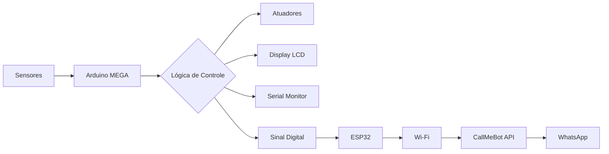

# Auto Greenhouse 🌱

[](LICENSE)
[](https://www.arduino.cc/)
[](https://www.espressif.com/)

Sistema IoT de estufa automatizada para monitoramento e controle ambiental, desenvolvido com **Arduino MEGA 2560** para gerenciamento local de sensores/atuadores e **ESP32** para conectividade Wi-Fi e notificações remotas via WhatsApp.

## 📑 Índice

- [Visão Geral](#-visão-geral)
- [Funcionalidades](#-funcionalidades)
- [Tech Stack](#-tech-stack)
- [Pré-requisitos](#-pré-requisitos)
- [Lista de Componentes](#-lista-de-componentes)
- [Diagrama de Conexões](#-diagrama-de-conexões)
- [Configuração do Ambiente](#-configuração-do-ambiente)
- [Calibração de Sensores](#-calibração-de-sensores)
- [Upload do Código](#-upload-do-código)
- [Arquitetura do Sistema](#-arquitetura-do-sistema)
- [Configuração de Notificações](#-configuração-de-notificações)
- [Troubleshooting](#-troubleshooting)
- [Contribuição](#-contribuição)
- [Licença](#-licença)

---

## 📖 Visão Geral

O **Auto Greenhouse** é um projeto DIY de automação agrícola que monitora condições ambientais críticas para o cultivo de plantas e executa ações automáticas para manter o ambiente ideal. O sistema combina:

- **Arduino MEGA 2560**: Cérebro principal responsável por leitura de sensores, controle de atuadores e interface local via LCD.
- **ESP32**: Módulo de conectividade Wi-Fi que envia notificações para WhatsApp via API CallMeBot.
- **Sensores**: Umidade do solo, luminosidade (LDR) e temperatura (LM35 - opcional).
- **Atuadores**: Bombas de irrigação, ventilador, servo para teto, LEDs de crescimento.

> 💡 **Caso de Uso Ideal**: Pequenas estufas residenciais, projetos educacionais de IoT, prototipagem de agricultura de precisão.

---

## ✨ Funcionalidades

### Controle Automático
- 💧 **Irrigação Inteligente**: Bomba ativa quando umidade do solo < 33% (ajustável), desliga automaticamente ao atingir nível ideal
- 💡 **Iluminação Adaptativa**: LEDs acionados quando luminosidade ambiente < 75 (escala 0-100)
- 🌬️ **Ventilação Manual**: Ventilador controlado por botão físico com feedback no LCD

### Interface Local
- 📺 **Display LCD 16x2**: Exibe em tempo real:
  - Umidade do solo (%), Luminosidade (0-100)
  - Status da irrigação (`Irr ON`/`       `)
  - Status do ventilador (`FAN ON`/`FAN OFF`)

### Controle Manual
- 🔘 **Botão Servo (Pino 32)**: Alterna abertura/fechamento do teto (0° ↔ 45°)
- 🔘 **Botão Ventilador (Pino 33)**: Liga/desliga ventilador manualmente

### Conectividade Remota (ESP32)
- 📡 **Conexão Wi-Fi**: ESP32 conecta-se à rede local
- 📱 **Notificações WhatsApp**: Envia alertas via CallMeBot API quando eventos ocorrem (ex: teto aberto)
- 🔗 **Comunicação Serial**: Arduino sinaliza eventos para ESP32 via pino digital

### Monitoramento
- 🖥️ **Serial Monitor**: Debug em tempo real via USB (9600 baud)
- 📊 **Logs Estruturados**: Saída formatada para análise de comportamento do sistema

---

## 🛠 Tech Stack

| Camada | Tecnologia | Versão/Função |
|--------|-----------|---------------|
| **Microcontrolador Principal** | Arduino MEGA 2560 | Leitura de sensores, controle de atuadores |
| **Módulo de Conectividade** | ESP32 Dev Module | Wi-Fi, HTTP requests para notificações |
| **IDE de Desenvolvimento** | Arduino IDE 2.x | Compilação e upload de sketches |
| **Bibliotecas Arduino** | `LiquidCrystal`, `Servo` | Controle de LCD 16x2 e servo motor |
| **Bibliotecas ESP32** | `WiFi`, `HTTPClient` | Conexão Wi-Fi e requests HTTP |
| **API de Notificação** | CallMeBot | Envio de mensagens para WhatsApp |
| **Protocolo de Comunicação** | UART Serial | Comunicação Arduino ↔ ESP32 (9600 baud) |

---

## 📦 Pré-requisitos

### Hardware
- Arduino MEGA 2560 com cabo USB
- ESP32 Dev Module com cabo USB ou adaptador serial
- Fonte de alimentação 12V para atuadores de potência (ventilador, bombas)

### Software
- [Arduino IDE 2.0+](https://www.arduino.cc/en/software) instalado
- Drivers USB instalados:
  - CH340/CP210x para ESP32: [Drivers Silabs](https://www.silabs.com/developers/usb-to-uart-bridge-vcp-drivers)
- Acesso à internet para instalação de bibliotecas

### Conta Externa
- Conta no [CallMeBot](https://www.callmebot.com/) para obter API token do WhatsApp

---

## 🔌 Lista de Componentes

### Arduino MEGA 2560
| Qtd | Componente | Observações |
|-----|-----------|-------------|
| 1x | Arduino MEGA 2560 | Placa principal |
| 1x | Display LCD 16x2 | Interface local (modo 4-bit) |
| 1x | Sensor de Umidade do Solo | Analógico (A0) |
| 1x | Sensor LDR (Luminosidade) | Analógico (A1) |
| 1x | Servo Motor SG90/MG996R | Controle do teto (Pino 44) |
| 2x | Botões momentâneos | Controle manual (Pinos 32, 33) |
| 1x | Módulo Relé 2 canais 5V | Controle de bombas (Pino 52) |
| 2x | Bombas d'água 5V/12V | Irrigação e drenagem |
| 1x | Ventilador 12V DC | Ventilação (Pino 8 via transistor/relé) |
| 1x | LED branco/amarelo | Simulação de luz de crescimento (Pino 11) |
| 1x | LM35 (opcional) | Sensor de temperatura (não implementado no loop principal) |
| Vários | Resistores 220Ω, 1kΩ, 10kΩ | Pull-ups, limitação de corrente |
| Vários | Jumpers e protoboard | Montagem do circuito |

### ESP32
| Qtd | Componente | Observações |
|-----|-----------|-------------|
| 1x | ESP32 Dev Module | Conectividade Wi-Fi |
| 1x | Cabo USB ou adaptador FTDI | Para upload do código |

### Alimentação
| Item | Especificação | Observações |
|------|--------------|-------------|
| Fonte 12V 2A+ | Para ventilador e bombas | Não alimentar atuadores diretamente do Arduino |
| Cabo USB 5V | Para Arduino e ESP32 | Alimentação lógica |

---

## 🔗 Diagrama de Conexões

### Arduino MEGA → Periféricos
```
LCD 16x2 (4-bit mode):
  RS  → Pino 2
  E   → Pino 3
  DB4 → Pino 4
  DB5 → Pino 5
  DB6 → Pino 6
  DB7 → Pino 7
  VSS → GND
  VDD → 5V
  RW  → GND
  VO  → Potenciômetro 10k para contraste
  A/K → 5V/GND (backlight com resistor 220Ω)

Sensores Analógicos:
  Umidade do Solo:
    VCC → Pino 12 (controlado por software)
    GND → GND
    SIG → A0
  
  LDR (Luminosidade):
    VCC → 5V
    GND → GND
    SIG → A1 (com resistor 10k em divisor de tensão)

Atuadores Digitais:
  Servo (teto):
    Sinal → Pino 44
    VCC   → 5V (ou externo para servos de alta torque)
    GND   → GND (comum)
  
  Ventilador:
    Controle → Pino 8 (via transistor MOSFET ou relé)
    Alimentação → Fonte 12V externa
  
  LED Crescimento:
    Ânodo → Pino 11 (com resistor 220Ω)
    Cátodo → GND
  
  Relé Bomba Irrigação:
    IN → Pino 52
    VCC → 5V
    GND → GND
    COM/NO → Bomba + Fonte 12V

Botões (INPUT_PULLUP):
  Servo Toggle → Pino 32 ↔ GND
  Fan Toggle   → Pino 33 ↔ GND

Comunicação com ESP32:
  Arduino TX (Pino 18) → ESP32 RX (Pino 16)
  Arduino GND → ESP32 GND (comum obrigatório)
```

### ESP32 → Wi-Fi → WhatsApp
```
ESP32:
  VCC → 5V (USB ou regulador)
  GND → GND (comum com Arduino)
  RX  → Pino 16 (recebe sinal do Arduino)
  TX  → Pino 17 (não utilizado neste projeto)

Fluxo de Notificação:
  Arduino detecta evento (ex: servo aberto)
  → Sinal digital HIGH no Pino 18
  → ESP32 lê sinal via digitalRead()
  → ESP32 conecta ao Wi-Fi (se necessário)
  → ESP32 faz HTTP GET para CallMeBot API
  → CallMeBot encaminha mensagem para WhatsApp
```

> ⚠️ **Atenção**: Sempre use **GND comum** entre Arduino e ESP32 para comunicação serial funcionar corretamente.

---

## ⚙️ Configuração do Ambiente

### 1. Instalar Arduino IDE
1. Baixe em [arduino.cc/en/software](https://www.arduino.cc/en/software)
2. Instale seguindo o assistente do seu sistema operacional

### 2. Adicionar Suporte ao ESP32
1. Abra Arduino IDE → `Arquivo` → `Preferências`
2. Em **URLs adicionais para Gerenciadores de Placas**, adicione:
   ```
   https://dl.espressif.com/dl/package_esp32_index.json
   ```
3. Vá em `Ferramentas` → `Placa` → `Gerenciador de Placas...`
4. Busque por **"esp32"** e instale o pacote **esp32 by Espressif Systems**
5. Selecione a placa: `Ferramentas` → `Placa` → `ESP32 Arduino` → `ESP32 Dev Module`

### 3. Instalar Bibliotecas
Via `Sketch` → `Incluir Biblioteca` → `Gerenciar Bibliotecas...`:

| Biblioteca | Necessária Para | Status |
|-----------|----------------|--------|
| `LiquidCrystal` | Controle do LCD 16x2 | ✅ Incluída no IDE |
| `Servo` | Controle do servo motor | ✅ Incluída no IDE |
| `WiFi` (ESP32) | Conexão Wi-Fi no ESP32 | ✅ Incluída no core ESP32 |
| `HTTPClient` (ESP32) | Requests HTTP para CallMeBot | ✅ Incluída no core ESP32 |

---

## 🎛 Calibração de Sensores

### Umidade do Solo (Sensor Analógico)
O código usa mapeamento linear para converter leitura ADC (0-1023) para porcentagem (0-100%):

```cpp
humidity = map(humidity, 1023, 372, 0, 100);
```

**Como calibrar para seu sensor**:
1. Faça upload do código com `Serial.println(analogRead(humSensor));` temporário
2. Anote o valor com sensor **seco no ar** (ex: ~1023)
3. Anote o valor com sensor **totalmente submerso em água** (ex: ~372)
4. Atualize o `map()`: `map(valor, valor_seco, valor_molhado, 0, 100)`

> 💡 Sensores capacitivos são mais duráveis que resistivos para uso contínuo no solo.

### Luminosidade (LDR)
```cpp
brightness = map(brightness, 100, 970, 100, 0);
```

**Calibração**:
1. Meça o valor ADC no **escuro total** (ex: ~970)
2. Meça o valor ADC sob **luz direta** (ex: ~100)
3. Ajuste o `map()` conforme seus valores
4. O mapeamento inverte a escala: mais luz = menor valor numérico

### Limiares de Atuação (Ajustáveis no Código)
| Parâmetro | Valor Padrão | Localização no Código | Recomendação |
|-----------|-------------|----------------------|--------------|
| Umidade mínima para irrigar | `33` | Linha ~135: `if (humidity < 33)` | Ajuste conforme tipo de planta/solo |
| Luminosidade para acender LED | `75` | Linha ~148: `if (brightness < 75)` | Teste em diferentes condições de luz |

---

## 📤 Upload do Código

### Arduino MEGA
1. Conecte o Arduino via USB
2. No Arduino IDE: `Ferramentas` → `Placa` → `Arduino AVR Boards` → `Arduino Mega or Mega 2560`
3. `Ferramentas` → `Porta` → Selecione a porta COM correta
4. Abra `ARDUINO_MEGA/ARDUINO_MEGA.ino`
5. Clique em **Upload** (→) ou pressione `Ctrl+U`
6. Aguarde a mensagem "Done uploading."

### ESP32
1. Conecte o ESP32 via USB
2. No Arduino IDE: `Ferramentas` → `Placa` → `ESP32 Arduino` → `ESP32 Dev Module`
3. `Ferramentas` → `Porta` → Selecione a porta COM do ESP32
4. Configure as opções:
   ```
   Upload Speed: 921600
   CPU Frequency: 240MHz (WiFi/BT)
   Flash Frequency: 80MHz
   Flash Mode: QIO
   Partition Scheme: Default 4MB with spiffs
   ```
5. Abra o sketch do ESP32 e configure as credenciais Wi-Fi:
   ```cpp
   const char* ssid = "SEU_WIFI";
   const char* password = "SUA_SENHA";
   const char* token = "SEU_TOKEN_CALLMEBOT";
   const char* phoneNumber = "5511999999999"; // Com código do país
   ```
6. Clique em **Upload**
   > ⚠️ Se falhar, pressione e segure o botão **BOOT** no ESP32 durante o upload

---

## 🏗 Arquitetura do Sistema

### Fluxo de Dados Principal


### Loop Principal do Arduino (`loop()`)
1. **Leitura de Sensores** (`humRead()`, `brightRead()`)
   - Ativa VCC do sensor de umidade apenas durante leitura (economia + prevenção de corrosão)
   - Mapeia valores brutos para escala 0-100
   - Atualiza LCD com valores formatados

2. **Controle de Irrigação**
   ```cpp
   if (humidity < 33) {
     digitalWrite(relayIrrigation, LOW);  // Relé ativo = bomba LIGA
     lcd.print("Irr ON ");
   } else {
     digitalWrite(relayIrrigation, HIGH); // Relé inativo = bomba DESLIGA
     lcd.print("       ");
   }
   ```
   > 🔁 Lógica invertida: relés normalmente abertos (NO) exigem `LOW` para ativar

3. **Controle de Iluminação**
   ```cpp
   if (brightness < 75) {
     digitalWrite(ledPin, HIGH);  // Acende LED
   }
   ```

4. **Leitura de Botões (com debounce manual)**
   - Detecta transição `HIGH → LOW` (pressão do botão com `INPUT_PULLUP`)
   - Alterna estado do servo (0° ↔ 45°) ou ventilador (ON ↔ OFF)

5. **Atualização do LCD**
   - Posições fixas para evitar flickering:
     - Linha 0: `U: XX  Irr ON `
     - Linha 1: `LUM: XXX  FAN OFF`

### Comunicação Arduino → ESP32
```cpp
// No Arduino (transmissor)
const byte signalPin = 18;  // Pino de sinal para ESP32

void notifyESP32() {
  digitalWrite(signalPin, HIGH);  // Sinaliza evento
  delay(100);                     // Pulso de 100ms
  digitalWrite(signalPin, LOW);
}

// No ESP32 (receptor)
const byte arduinoSignalPin = 16;

void loop() {
  if (digitalRead(arduinoSignalPin) == HIGH) {
    sendWhatsAppNotification("🌱 Teto da estufa aberto!");
    delay(500);  // Evita múltiplos envios
  }
}
```

---

## 📱 Configuração de Notificações (CallMeBot)

### Passo a Passo
1. Acesse [CallMeBot - WhatsApp API](https://www.callmebot.com/blog/free-api-whatsapp-messages/)
2. Adicione o contato **+34 644 68 78 08** no WhatsApp
3. Envie a mensagem: `I allow callmebot to send me messages`
4. Você receberá seu **API Token** (ex: `1234567890`)

### Configurar no Código do ESP32
```cpp
// Credenciais Wi-Fi
const char* ssid = "MinhaRede";
const char* password = "SenhaDaRede";

// Credenciais CallMeBot
const char* token = "1234567890";  // Seu token recebido
const char* phoneNumber = "5511999999999";  // +55 + DDD + número

// Função de envio (já implementada no sketch)
void sendWhatsAppNotification(String message) {
  if (WiFi.status() == WL_CONNECTED) {
    HTTPClient http;
    String url = "https://api.callmebot.com/whatsapp.php?phone=" + 
                 String(phoneNumber) + 
                 "&text=" + message + 
                 "&apikey=" + String(token);
    http.begin(url);
    int responseCode = http.GET();
    http.end();
  }
}
```

### Eventos que Disparam Notificações (Exemplos)
```cpp
// No Arduino, após abrir o teto:
if (servoOpen) {
  digitalWrite(18, HIGH);  // Sinaliza para ESP32
  delay(100);
  digitalWrite(18, LOW);
}

// No ESP32, ao detectar sinal:
if (digitalRead(16) == HIGH) {
  sendWhatsAppNotification("🔓 Teto da estufa aberto manualmente");
}
```

> 🔐 **Segurança**: O token da API é sensível. Em produção, considere usar variáveis de ambiente ou armazenamento seguro no ESP32.

---

## 🐛 Troubleshooting

### Problemas Comuns

| Sintoma | Causa Provável | Solução |
|---------|---------------|---------|
| LCD exibe quadrados/sem texto | Contraste (VO) mal ajustado | Gire o potenciômetro de contraste do LCD |
| Sensor de umidade sempre 0% ou 100% | Calibração incorreta ou sensor desconectado | Verifique conexões e recalibre com `map()` |
| Bomba não liga mesmo com umidade baixa | Lógica invertida do relé ou alimentação insuficiente | Confirme: `LOW` liga relé; use fonte externa 12V para bombas |
| ESP32 não conecta ao Wi-Fi | SSID/senha incorretos ou sinal fraco | Verifique credenciais; aproxime ESP32 do roteador |
| Notificação não chega no WhatsApp | Token inválido ou número formatado errado | Confirme token recebido; use formato `55DDNNNNNNNNN` |
| Arduino e ESP32 não se comunicam | GND não conectado ou pinos trocados | Conecte GNDs; confirme: Arduino TX (18) → ESP32 RX (16) |
| Servo treme ou não move | Alimentação insuficiente para servo | Use fonte externa 5V/2A para servo de alto torque |

### Debug via Serial Monitor
1. Abra `Ferramentas` → `Monitor Serial` (ou `Ctrl+Shift+M`)
2. Configure baud rate para **9600**
3. Observe saída formatada:
   ```
   Humidity: 28
   Brightness: 65
   Irrigation pump ON (continuous)
   LEDs ON
   Servo button pressed
   Fan turned ON
   ```

### Reset de Fábrica do ESP32
Se o ESP32 travar ou não responder:
```bash
# Via Arduino IDE:
# 1. Segure BOOT + EN (RESET) por 2 segundos
# 2. Solte EN, mantenha BOOT por mais 1 segundo
# 3. Solte BOOT
# 4. Tente upload novamente

# Ou via comando esptool:
esptool.py --chip esp32 erase_flash
```

---

## 🤝 Contribuição

Contribuições são bem-vindas! Siga estas etapas:

1. **Fork** o repositório
2. Crie uma branch para sua feature:  
   ```bash
   git checkout -b feature/melhoria-sensor-temperatura
   ```
3. Implemente suas alterações com commits descritivos:
   ```bash
   git commit -m "feat: adiciona leitura do sensor LM35 no LCD"
   ```
4. Teste em hardware real antes de enviar
5. Envie um **Pull Request** descrevendo:
   - O que foi alterado
   - Como testar a mudança
   - Impacto no consumo de energia/performance

### Diretrizes de Código
- Mantenha compatibilidade com Arduino MEGA 2560 e ESP32 Dev Module
- Documente novos pinos ou bibliotecas no README
- Use `INPUT_PULLUP` para botões (evita resistores externos)
- Evite `delay()` longo em loops críticos; prefira `millis()` para timing não-bloqueante

---

## 📄 Licença

Este projeto é licenciado sob a **GNU Affero General Public License v3.0** (AGPL-3.0).

### O que isso significa para você:
✅ Você pode:
- Usar, modificar e distribuir o código
- Criar derivados para uso pessoal ou comercial

⚠️ Você deve:
- Disponibilizar o código-fonte completo de qualquer versão modificada **se o software for acessado via rede** (ex: dashboard web da estufa)
- Manter os avisos de licença e autoria originais
- Licenciar derivados sob a mesma licença AGPL-3.0

❌ Você não pode:
- Fechar o código de uma versão modificada que seja acessada remotamente
- Remover avisos de licença ou autoria

📄 Leia a licença completa em: [LICENSE](LICENSE)  
🌐 Mais informações: [https://www.gnu.org/licenses/agpl-3.0.html](https://www.gnu.org/licenses/agpl-3.0.html)

---

> 💡 **Dica Final**: Este projeto foi desenvolvido para fins educacionais. Para uso em produção, considere adicionar:
> - Proteção contra surtos elétricos (varistores, fusíveis)
> - Sensor de temperatura e umidade do ar (DHT22)
> - Bateria de backup para falhas de energia
> - Dashboard web local (ESP32 como servidor HTTP)

**Happy gardening! 🌿**
